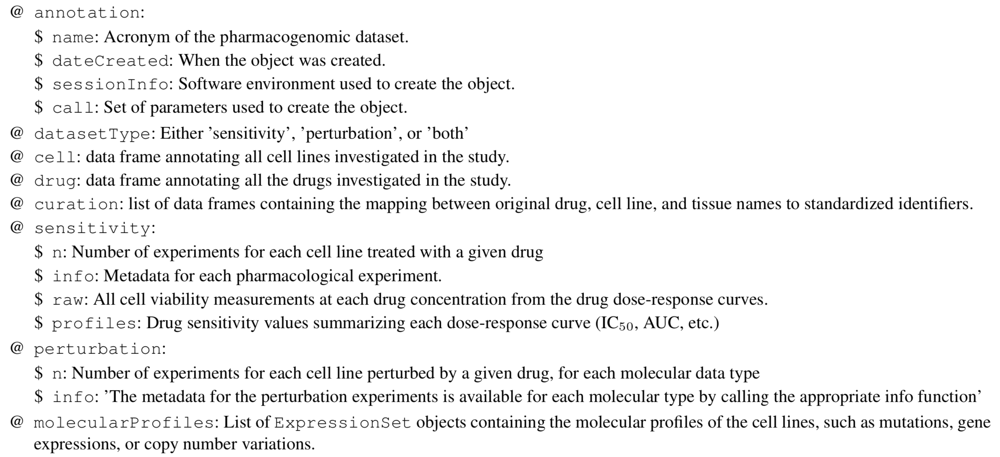

The main purpose of this hands on activity is to familiarize the participant with the different packages available to download, preprocess and visualize pharmacogenomics data. In particular, we will be focusing on two R packages, `PharmacoGx` [1][] and `GRmetrics`, and giving a brief overview of the `GDSCTools` python package. 


# PharmacoGx

`r BiocStyle::Biocpkg("PharmacoGx")` was developed to serve as a platform for
integrating analysis across different datasets. The main focus of the `r
BiocStyle::Biocpkg("PharmacoGx")` package is to provide access to
pharmacogenomics datasets that have been preprocessed with a uniform pipeline,
and extensively curated to ensure maximum overlap and consistency. For this
purpose, PharmacoGx introduces new data structure called a PharmacoSet, or PSet
for short, for storing pharmacogenomics studies, based on a level of abstraction
from the raw experimental data, and allows bioinformaticians and biologists to
work with data at the level of genes, drugs and cell lines. This provides a more
intuitive interface and, in combination with unified curation, simplifies
analyses between multiple datasets. The purpose of this section is to
familiarize the reader with the data structures and utilites provided by
PharamcoGx, to most quickly access pharmacogenomics data of interest.


We start by installing the `r BiocStyle::Biocpkg("PharmacoGx")` package, and
then introduce the PSet object structure, key functions to access data from 
downloaded datasets, and some of the functionality implemented in the package
for extracting and summarizing pharmacogenomics data. 


`r BiocStyle::Biocpkg("PharmacoGx")` is available from the Bioconductor project.
To install `r BiocStyle::Biocpkg("PharmacoGx")`, we use the `r
BiocStyle::CRANpkg("BiocManager")` library:

```{r loadlib1, eval=TRUE, results='hide'}
getwd()

library(BiocManager)
library(Biobase)
require(PharmacoGx) || install("PharmacoGx")

```


Load `r BiocStyle::Biocpkg("PharmacoGx")` into your current workspace:
```{r loadlib, eval=TRUE, results='hide'}
suppressPackageStartupMessages({
  library(PharmacoGx, verbose=FALSE)
  library(Biobase, verbose=FALSE)
})
```

## Overview of the PharmacoSet

PharmacoGx was made to unify the preprocessing and annotation between public 
Pharmacogenomics studies, so that the analyst can spend less time in data
sanitization, and skip straight to the analysis. As such, PharmacoSets for 
major datasets are available for download from our servers. These PSets all
went through a unified Preprocessing, QC, Normalization and Annotation 
Pipeline.


### Downloading PharmacoSet objects
Let us try to download a PSet onto our local working environment. A table of
available PharmacoSet objects can be obtained by using the *availablePSets*
function. Any of the PharmacoSets in the table can then be downloaded by calling
*downloadPSet*, which saves the datasets into a directory of the users choice,
and returns the data into the R session. Lets try downloading the GDSC and CCLE
PSets.
```{r download_psets, eval=TRUE}
  availablePSets(saveDir=file.path(".", "PSets"))
  GDSC <- downloadPSet("GDSC", saveDir=file.path(".", "PSets")) 
  CCLE <- downloadPSet("CCLE", saveDir=file.path(".", "PSets"))
```

The basic structure of a PharmacoSet is as follows:



### Working with PSets

For most of your work with PSet objects, we recommend you use the accessor
functions implemented in the package to access the data stored in the object.
For example, here we can use the *cellInfo* function to pull out the tissue of
origin for each cell line in the CCLE dataset. The *tissueid* column is standard
for PSets, and should be present in all objects.

```{r piechart, fig.cap="Tissue of origin of cell lines in CCLE study"}
mycol <- c("#8dd3c7","#ffffb3","#bebada","#fb8072","#80b1d3","#fdb462",
           "#b3de69","#fccde5","#d9d9d9","#bc80bd","#ccebc5","#ffed6f",
           "#a6cee3","#1f78b4","#b2df8a","#33a02c","#fb9a99","#e31a1c",
           "#fdbf6f","#ff7f00","#cab2d6","#6a3d9a","#ffff99","#b15928")
pie(table(CCLE@cell[,"tissueid"]), 
    col=mycol, 
    main="Tissue types", 
    radius=1, 
    cex=0.8)
```

While we will introduce some of the functions for working with PSets in this
tutorial, the documentation of the PharmacoSet object contains descriptions of
the available functions to interface with PSet objects:

```{r docs, eval=TRUE}
?`PharmacoSet-class`
```

PSets can be subsetted by refering directly to the drugs and cell lines you want
to keep in the dataset. For example, we can subset the GDSC PSet in the following 
ways:

```{r subsets, eval=TRUE}
print(GDSC)
print(drugNames(GDSC)[1])
print(subsetTo(GDSC, drugs="Erlotinib"))
print(GDSC["YT","Erlotinib"])

```

As an exercise, lets manually compute the number of overlaping cell lines and
drugs between CCLE and GDSC. Try it yourself! 

If you noticed as you completed the previous exercise, cell line and drug names 
are standardized between PSets downloaded using the *downloadPSet* function. 

PharmacoGx also implements a convenience function to intersect PSets:

```{r intersect, echo=TRUE, eval=FALSE}

common <- intersectPSet(list(CCLE, GDSC), intersectOn=c("drugs", "cell.lines"))
print(common)

```


## PharmacoGx Functionality

In addition to defining the PSet data structure, PharmacoGx implements some basic preprocessing, plotting and analysis functions,
designed to help the user create objects for use in biomarker discovery or machine learning tasks.


### Fitting Drug Dose Response Curves

One of the core tasks implemented in PharmacoGx is the fitting of Hill Curve Models to dose-response data. In PharmacoGx, we use the 
3 Parameter Hill Slope function as our model of drug response in cancer cell lines:
 


To fit a Hill Slope model to you data, you can use the *logLogisticRegression* function, as below:

```{r loglogistic}


concentrations <- 1/2^seq(0,8) * 1
viabilities <-  c(0, 33.3, 60, 77.8, 88.2, 93.9, 96.9, 98.4, 99.2)

pars <- logLogisticRegression(conc = conentrations, viability = viabilities)
print(pars)
```


### Plotting Drug Dose Response Data

Drug-Dose response data included in the PharmacoSet objects can be conviniently plotted using the *drugDoseResponseCurve* function. Given a list of PharmacoSets, a drug name and a cell name, it will plot the drug dose response curves for the given cell-drug combination in each dataset, allowing direct comparisons of data between datasets. 

```{r curves}
cells <- c("OCI-AML2","A253","NCI-H1648")
par(mfrow=c(1, 3), pty = "s")
drugDoseResponseCurve(drug="lapatinib", cellline=cells[1], 
                      pSets=list(CCLE, GDSC), plot.type="Fitted", 
                      legends.label="auc_published")
drugDoseResponseCurve(drug="lapatinib", cellline=cells[2], 
                      pSets=list(CCLE, GDSC), plot.type="Fitted", 
                      legends.label="auc_published")
drugDoseResponseCurve(drug="lapatinib", cellline=cells[3], 
                      pSets=list(CCLE, GDSC), plot.type="Fitted", 
                      legends.label="auc_published")
```

The function *drugDoseResponseCurve* can also be used to plot your own drug dose response curves, as follows:

```{r ddrc_own}

concentrations <- 1/2^seq(0,8) * 1
viabilities <-  c(0, 33.3, 60, 77.8, 88.2, 93.9, 96.9, 98.4, 99.2)

drugDoseResponseCurve(concentrations = list("Exp 1" = concentrations), viabilities = list("Exp 1" = viabilities))

```


### Computing Summary Measures for DDRCs

Often with in vitro Pharmacogenomics data, we want to compare the drug sensitivity of a cell line 
to some omic feature. For this, we want to summarize the drug dose response curve into a single 
number representing the sensitivity of the cell line. The IC50 and Area Above the curve are two
convenient metrics for quuantifying the observed drug sensitivity. If you noticed above, 
the *drugDoseResponseCurve* function computes them by default. In PharmacoGx, they can be 
computed manually as follows:

```{r ddrc_own}

concentrations <- rev(1/2^seq(0,8) * 1)
viabilities <-  c(99.2, 98.4, 96.9, 93.9, 88.2, 77.8, 60, 33.3, 0)

print(computeAUC(concentration = concentrations, viability = viabilities))
print(computeIC50(concentration = concentrations, viability = viabilities))

```

In *PharmacoGx*, we call these measures sensitivity measures. PSets come with these measures precomputed, and accessible using the *sensitivityProfiles* function:

```{r sensProf}
head(sensitivityProfiles(CCLE))
```


### Summary Functions

Pharmacogenomics studies often contain many examples of either replicated or missing data.
One of the most common tasks in preparing data for statistical or machine learning analysis is 
aligning your features and labels. To accelerate using Pharmacogenomics data for analysis, 
*PharmacoGx* contains two functions which create deduplicated matrices with missing data filled
by NAs: *summarizeSensitivityProfiles* and *summarizeMolecularProfiles*. They create matrices
which are drugs x cell lines and molecular features x cell lines, with any cell lines profiled
for only sensitivity or molecular features padded with NA values.

```{r summary}
dim(summarizeMolecularProfiles(CCLE, "rna"))
dim(summarizeSensitivityProfiles(CCLE))
```


Below, we use the summarizeMolecularProfiles function and ggplot to investigate the distributions of 
AUC values within CCLE.

```{r ccleauc, fig.cap="Cells response to drugs in CCLE"}
library(ggplot2, verbose=FALSE)
library(reshape2, verbose=FALSE)
CCLE.auc <- summarizeSensitivityProfiles(CCLE, sensitivity.measure = "auc_recomputed")
melted_data <- melt(CCLE.auc)
NA_rows <- unique(which(is.na(melted_data), arr.ind=T)[,1])
melted_data <- melted_data[-NA_rows,]
p <- ggplot(melted_data, aes(x=Var1,y=value)) +
  geom_boxplot(fill="gray") +
  theme(axis.text.x=element_text(angle=90,hjust=1)) +
  xlab("Drugs") +
  ylab("AAC")
print(p)
```

## Replication 
In this section we will investigate the consistency between the GDSC and CCLE datasets. In both CCLE and GDSC, the transcriptome of cells was profiled using an Affymatrix microarray chip. Cells were also tested for their response to increasing concentrations of various compounds, and form this the IC50 and AUC were computed. However, the cell and drugs names used between the two datasets were not consistent. Furthermore, two different microarray platforms were used. However, *PharmacoGx* allows us to overcome these differences to do a comparative study between these two datasets. 

GDSC was profiled using the hgu133a platform, while CCLE was profiled with the expanded hgu133plus2 platform. While in this case the hgu133a is almost a strict subset of hgu133plus2 platform, the expression information in *PharmacoSet* objects is summarized by Ensemble Gene Ids, allowing datasets with different platforms to be directly compared. The probe to gene mapping is done using the BrainArray customCDF for each platform \cite{sabatti_thresholding_2002}.

To begin, you would load the datasets from disk or download them using the *downloadPSet* function above.

We want to investigate the consistency of the data between the two datasets. The common intersection between the datasets can then be found using *intersectPSet*. We create a summary of the gene expression and drug sensitivity measures for both datasets, so we are left with one gene expression profile and one sensitivity profile per cell line within each dataset. We can then compare the gene expression and sensitivity measures between the datasets using a standard correlation coefficient. 

```{r Replicationcurves, fig.cap="Consistency of drug response curves across studies", results='hide'}
common <- intersectPSet(pSets = list("CCLE"=CCLE, "GDSC"=GDSC), 
                        intersectOn = c("cell.lines", "drugs"), 
                        strictIntersect = TRUE)
drugs <- drugNames(common$CCLE)
##Example of concordant and discordant drug curves
cases <- rbind(
  c("CAL-85-1", "17-AAG"),
  c("HT-29", "PLX4720"),
  c("COLO-320-HSR", "AZD6244"),
  c("HT-1080", "PD-0332991"))
par(mfrow=c(2, 2))
for (i in seq_len(nrow(cases))) {
  drugDoseResponseCurve(pSets=common, 
                        drug=cases[i,2], 
                        cellline=cases[i,1], 
                        legends.label="ic50_published", 
                        plot.type="Fitted", 
                        ylim=c(0,130))
}
```

### Consistency of pharmacological profiles
```{r sensitivityscatterplots, fig.height=5, fig.width=10, fig.cap="Concordance of AAC values", eval=FALSE}
  
##AAC scatter plot 
GDSC.aac <- summarizeSensitivityProfiles(
    pSet=common$GDSC,
    sensitivity.measure='auc_recomputed', 
    summary.stat="median",
    verbose=FALSE)
CCLE.aac <- summarizeSensitivityProfiles(
  pSet=common$CCLE,
  sensitivity.measure='auc_recomputed', 
  summary.stat="median",
  verbose=FALSE)
GDSC.ic50 <- summarizeSensitivityProfiles(
    pSet=common$GDSC, 
    sensitivity.measure='ic50_recomputed', 
    summary.stat="median",
    verbose=FALSE)
CCLE.ic50 <- summarizeSensitivityProfiles(
  pSet=common$CCLE, 
  sensitivity.measure='ic50_recomputed', 
  summary.stat="median",
  verbose=FALSE)
drug <- "lapatinib"
#par(mfrow=c(1, 2))
myScatterPlot(x=GDSC.aac[drug,], 
              y=CCLE.aac[drug,], 
              method=c("transparent"), 
              transparency=0.8, pch=16, minp=50, 
              xlim=c(0, max(max(GDSC.aac[drug,], na.rm=T), max(CCLE.aac[drug,], na.rm=T))), 
              ylim=c(0, max(max(GDSC.aac[drug,], na.rm=T), max(CCLE.aac[drug,], na.rm=T))), 
              main="cells response to lapatinib", 
              cex.sub=0.7, 
              xlab="AAC in GDSC", 
              ylab="AAC in CCLE")
legend("topright",
         legend=sprintf("r=%s\nrs=%s\nCI=%s", 
                 round(cor(GDSC.aac[drug,], 
                           CCLE.aac[drug,], 
                           method="pearson",
                           use="pairwise.complete.obs"), 
                       digits=2),
                 round(cor(GDSC.aac[drug,], 
                           CCLE.aac[drug,], 
                           method="spearman",
                           use="pairwise.complete.obs"), 
                       digits=2),
                 round(paired.concordance.index(GDSC.aac[drug,],
                                                CCLE.aac[drug,],
                                                delta.pred=0,
                                                delta.obs=0)$cindex, 
                       digits=2)), 
         bty="n")
```


# References 

[1]: Smirnov et al. 
